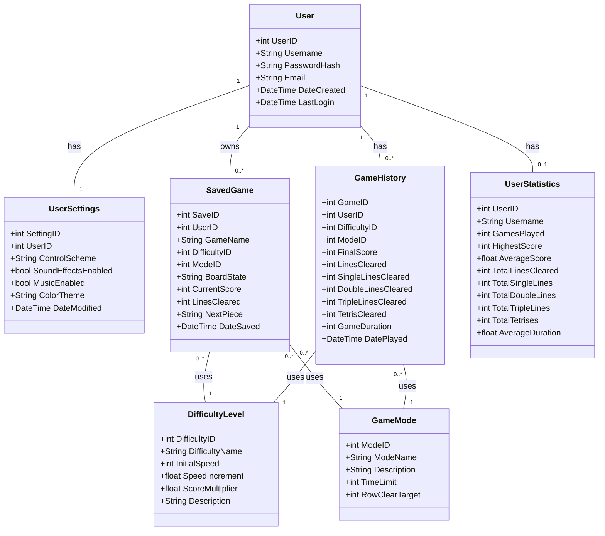
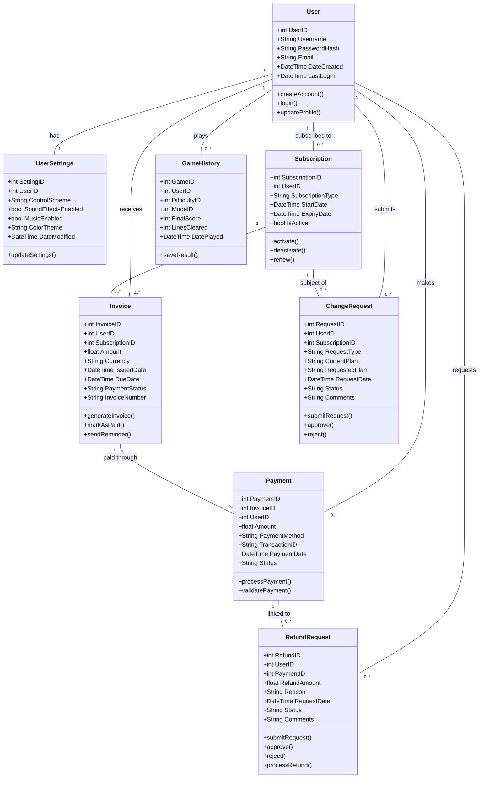

# Class Diagram for Tetris Game

## Extended Model with Invoice, Change Request and Refund Request

Since the original data model does not include invoices, change requests, or refund requests, here's an extended model incorporating these entities:

