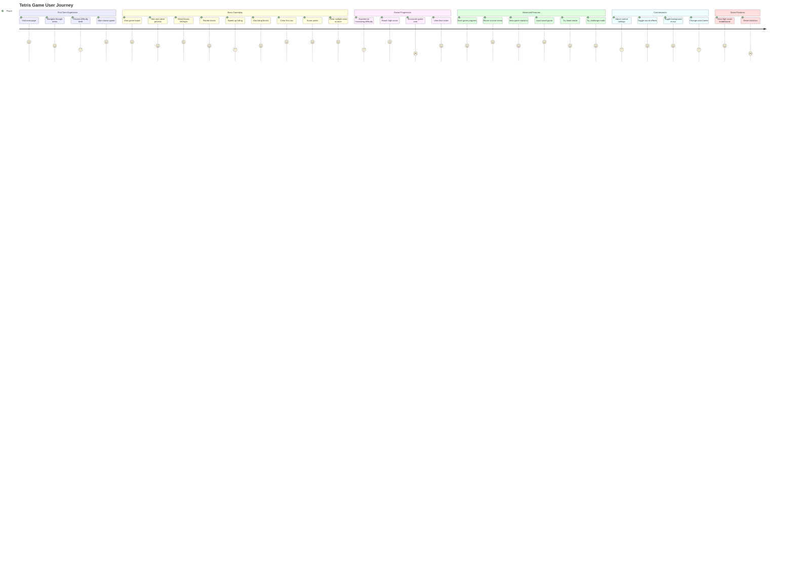
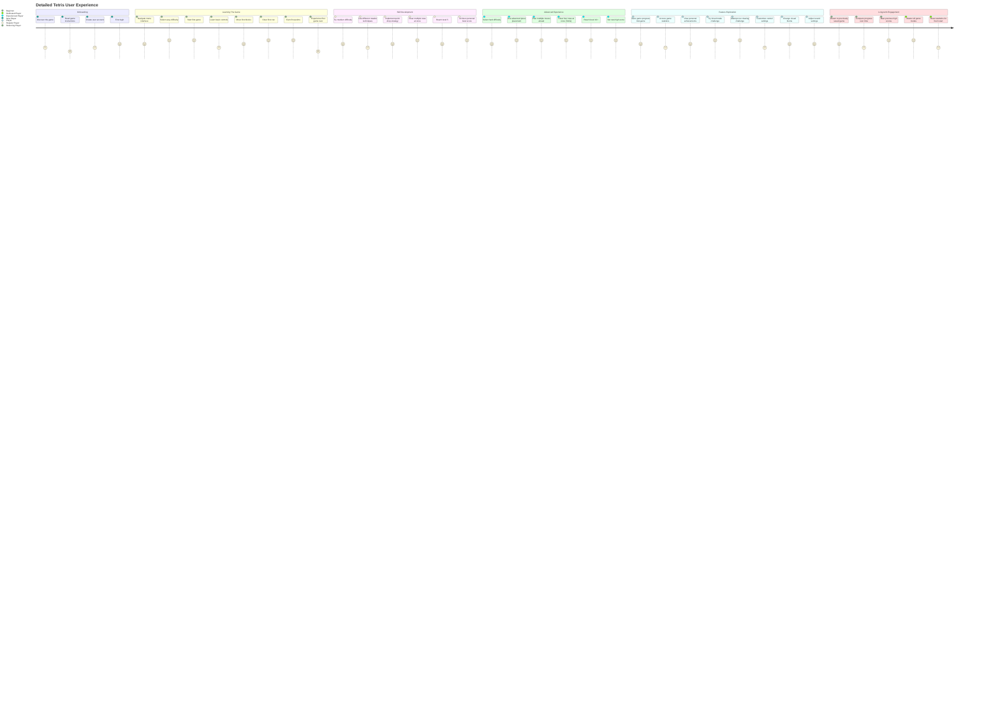

# Tetris - User Journey

```mermaid
journey
    title Tetris Game User Journey
    
    section First Time Experience
    Visit main page: 5: Player
    Navigate through menu: 4: Player
    Choose difficulty level: 3: Player
    Start classic game: 5: Player
    
    section Basic Gameplay
    View game board: 5: Player
    See next piece preview: 4: Player
    Move blocks left/right: 5: Player
    Rotate blocks: 4: Player
    Speed up falling: 3: Player
    Hard drop blocks: 4: Player
    Clear first row: 5: Player
    Score points: 5: Player
    Clear multiple rows at once: 5: Player
    
    section Game Progression
    Experience increasing difficulty: 3: Player
    Reach high score: 5: Player
    Encounter game over: 2: Player
    View final score: 4: Player
    
    section Advanced Features
    Save game progress: 4: Player
    Return to main menu: 5: Player
    View game statistics: 4: Player
    Load saved game: 5: Player
    Try timed mode: 4: Player
    Try challenge mode: 4: Player
    
    section Customization
    Adjust control settings: 3: Player
    Toggle sound effects: 4: Player
    Toggle background music: 4: Player
    Change color theme: 3: Player
    
    section Social Features
    View high score leaderboard: 4: Player
    Reset statistics: 2: Player
```

## Extended User Journey Map

The diagram below shows a more detailed user journey map with branching paths and emotional states:

```mermaid
journey
    title Detailed Tetris User Experience
    
    section Onboarding
    Discover the game: 3: New Player
    Read game instructions: 2: New Player
    Create user account: 3: New Player
    First login: 4: New Player
    
    section Learning The Game
    Navigate menu interface: 4: Beginner
    Select easy difficulty: 5: Beginner
    Start first game: 5: Beginner
    Learn basic controls: 3: Beginner
    Move first blocks: 4: Beginner
    Clear first row: 5: Beginner
    Earn first points: 5: Beginner
    Experience first game over: 2: Beginner
    
    section Skill Development
    Try medium difficulty: 4: Regular Player
    Use different rotation techniques: 3: Regular Player
    Implement quick drop strategy: 4: Regular Player
    Clear multiple rows at once: 5: Regular Player
    Reach level 5: 4: Regular Player
    Achieve personal best score: 5: Regular Player
    
    section Advanced Experience
    Select hard difficulty: 4: Experienced Player
    Use advanced piece placement: 5: Experienced Player
    Plan multiple moves ahead: 5: Experienced Player
    Clear four rows at once (Tetris): 5: Experienced Player
    Reach level 10+: 5: Experienced Player
    Set new high score: 5: Experienced Player
    
    section Feature Exploration
    Save game progress mid-game: 4: Player
    Access game statistics: 3: Player
    View personal achievements: 4: Player
    Try timed mode challenge: 5: Player
    Attempt row clearing challenge: 5: Player
    Customize control settings: 3: Player
    Change visual theme: 4: Player
    Adjust sound settings: 4: Player
    
    section Long-term Engagement
    Return to previously saved game: 4: Returning Player
    Compare progress over time: 3: Returning Player
    Beat previous high scores: 5: Returning Player
    Master all game modes: 5: Dedicated Player
    Reset statistics for fresh start: 3: Dedicated Player
```
