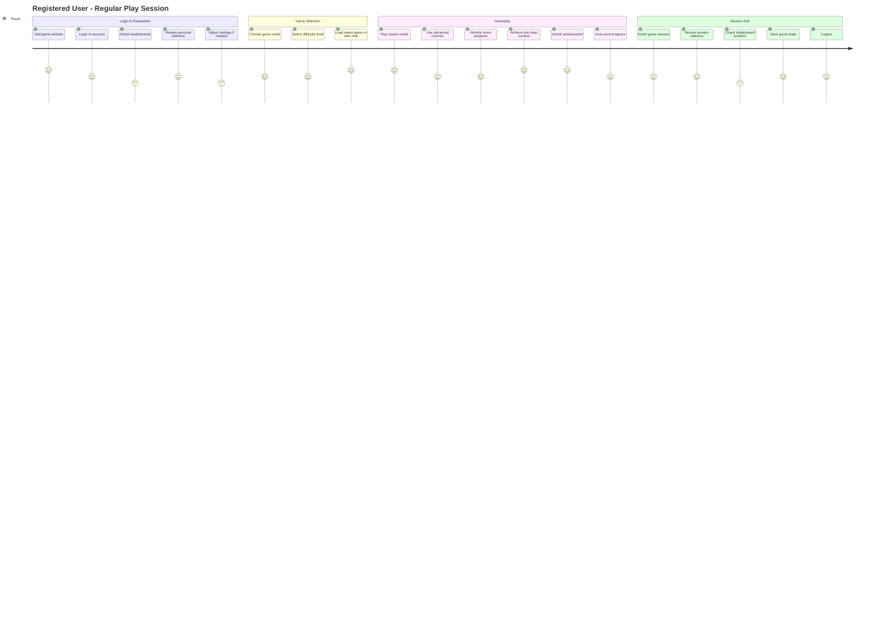
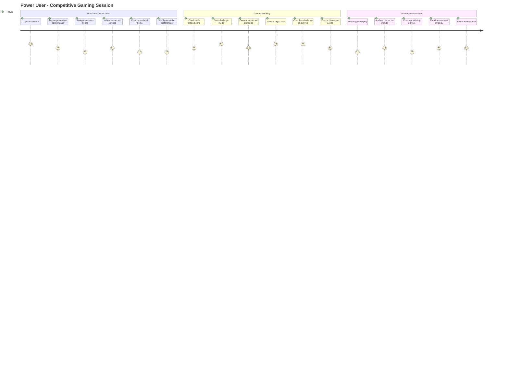
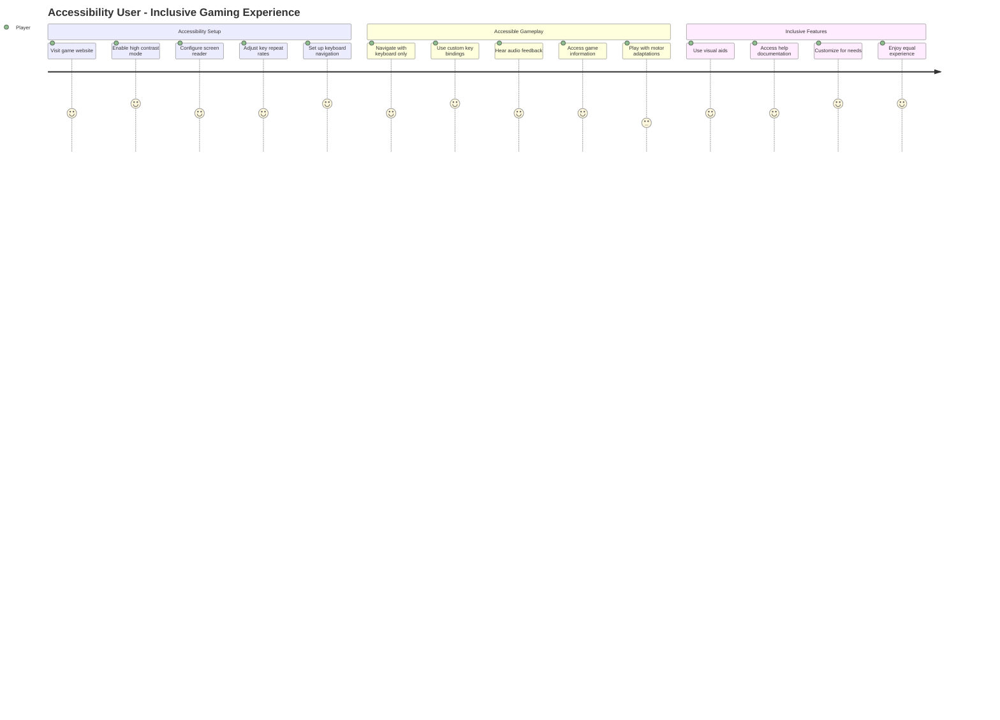
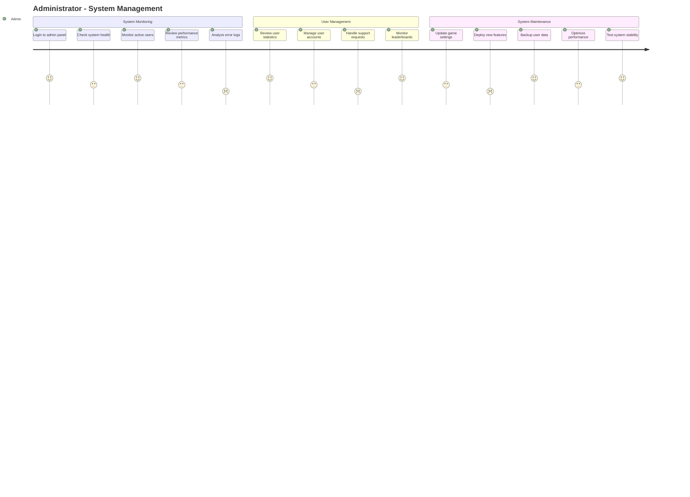
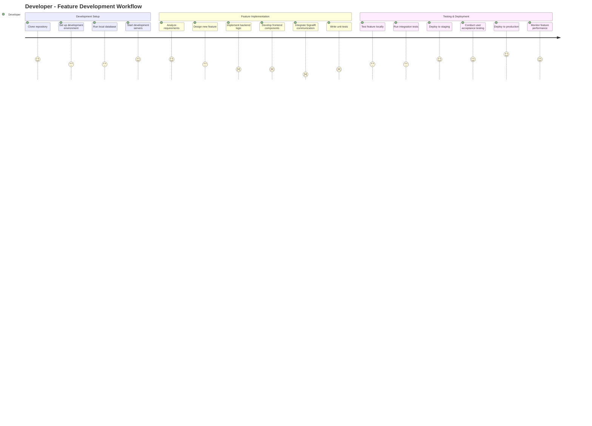
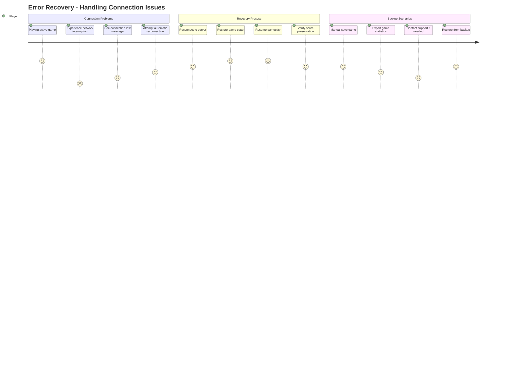
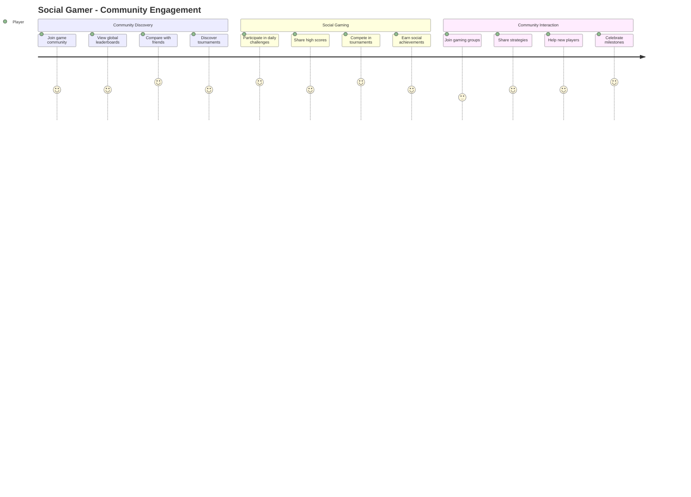
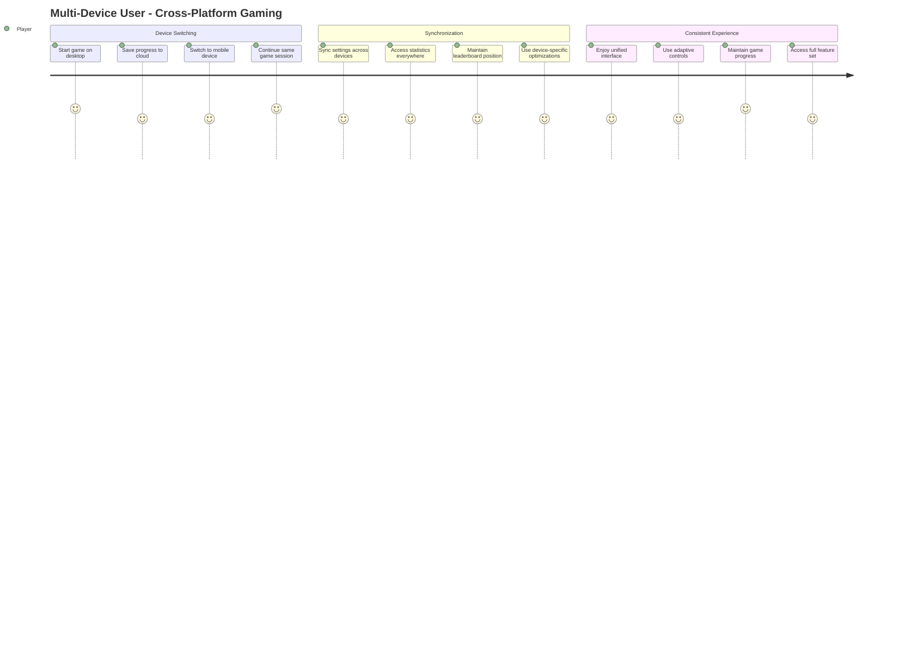
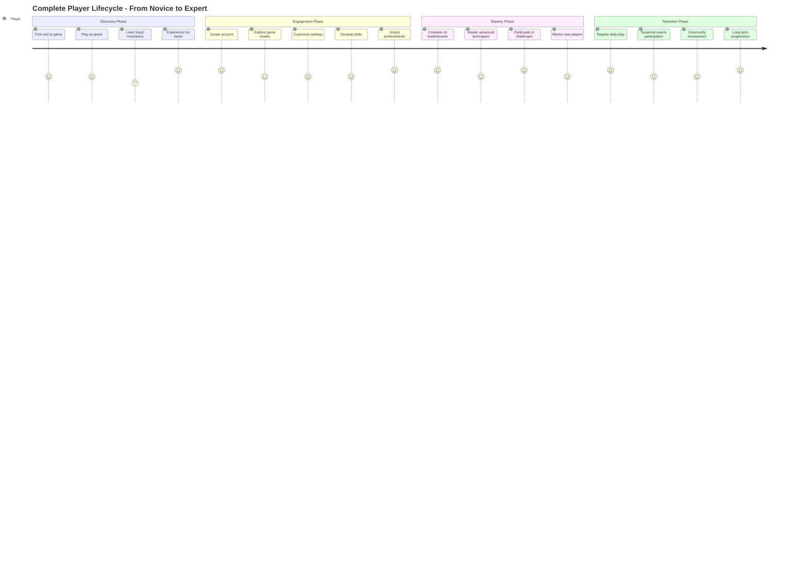

# Tetris Web Application - User Journey

## Overview

This document presents user journeys for the Tetris web application based on the feature requirements defined in `feature-requirement.md`. The journeys cover the complete player experience from initial discovery through advanced gameplay.

## Primary User Journey - New Player Experience

## Registered User Journey - Regular Play Session

## Power User Journey - Competitive Gaming

## Mobile User Journey - Touch Gaming

## Accessibility User Journey - Inclusive Gaming

## Administrator Journey - System Management

## Developer Journey - Feature Development

## Error Recovery Journey - Handling Issues

## Social Gaming Journey - Community Features

## Multi-Device Journey - Cross-Platform Experience

## Complete Player Lifecycle Journey

---

## Journey Insights

### Emotional Moments
- **High Points**: First line clear, high score achievements, unlocking new features
- **Low Points**: Learning curve struggles, connection issues, game over moments
- **Recovery Points**: Auto-save features, helpful tutorials, community support

### Critical Success Factors
1. **Smooth onboarding** for new players
2. **Reliable performance** across all devices
3. **Engaging progression** system
4. **Accessible design** for all users
5. **Strong community** features

### Pain Points to Address
1. **Learning curve** for new players
2. **Network connectivity** issues
3. **Device compatibility** challenges
4. **Performance optimization** needs
5. **Accessibility barriers**

These user journeys map directly to the feature requirements and help validate that the planned features will create positive user experiences across different player types and usage scenarios.
